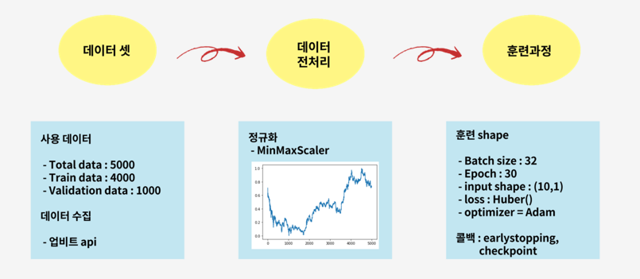
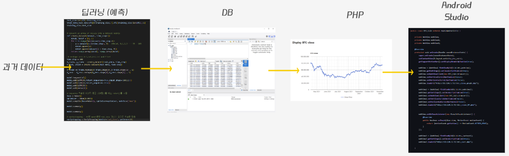
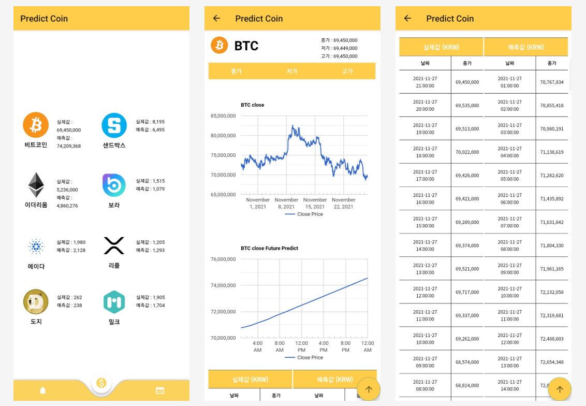

# Predict Coin

> LSTM 기반 암호화폐 가격 예측 어플리케이션

> 2021.08 - 2021.12
 

## Description

* 투자 손실률을 줄일 수 있는 수단 증가시키기 위한 목적으로 해당 프로젝트를 진행하기로 결정
* `LSTM 모델`을 이용하여 암호화폐 가격을 예측하고 예측가와 현재가를 그래프와 표의 형태로 보여준다. 
 

### LSTM

 

### Architecture
 

* Front-end &nbsp;&nbsp; 

  * 암호화폐 현재가와 예측가를 그래프와 표의 형태로 보여줌
 

* Back-end
&nbsp;&nbsp; 
&nbsp;&nbsp; 
&nbsp;&nbsp; 
&nbsp;&nbsp; 
&nbsp;&nbsp; 
&nbsp;&nbsp; 

  * LSTM 모델을 통해 예측한 가격을 DB에 저장
  * DB에 저장된 현재가와 예측가를 php로 보여줌
 

## Image

